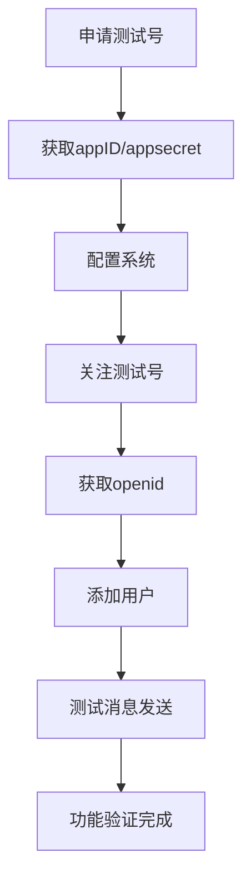

# 🚀 微信测试号快速测试指南

使用微信测试号可以**立即开始测试**您的每日信息简报系统，无需等待正式号审核！

## 🎯 为什么使用测试号？

### ✅ 巨大优势
- **零成本**：完全免费使用
- **零等待**：立即获得，无需审核
- **全功能**：支持所有API接口
- **真测试**：真实用户环境测试

### 📊 测试号 vs 正式号

| 对比项 | 测试号 | 正式号 |
|--------|--------|--------|
| 注册要求 | 扫码即得 | 需要认证 |
| 费用 | 免费 | 企业号需费用 |
| 审核时间 | 立即 | 1-7天 |
| 功能限制 | 无 | 有功能限制 |

## 🚀 快速开始（5分钟完成）

### 步骤1：获取测试号

1. 访问：[微信测试号申请页面](https://mp.weixin.qq.com/debug/cgi-bin/sandbox?t=sandbox/login)
2. 使用微信扫码登录
3. 立即获得测试号信息

### 步骤2：记录关键信息

测试号页面显示以下信息：

```
appID: wxxxxxxxxxxxxxxxx     # 测试号专用AppID
appsecret: xxxxxxxxxxxxxxxxxxxxxxxxxxxxxxxx  # 测试号专用AppSecret
接口配置信息: ...
测试号二维码: [二维码图片]
```

### 步骤3：配置系统

编辑测试号配置文件：

```bash
# 复制测试号配置模板
cp .env.test .env.test.account

# 编辑配置文件
nano .env.test.account
```

填入您的测试号信息：

```env
# 微信测试号配置
MINI_PROGRAM_APP_ID=wxxxxxxxxxxxxxxxx
MINI_PROGRAM_APP_SECRET=xxxxxxxxxxxxxxxxxxxxxxxxxxxxxxxx
MINI_PROGRAM_TEMPLATE_ID=hh-rt2ihhh-rMUhhbrAapOOy5vfrju-trIkRFRJvfrc
```

### 步骤4：关注测试号

1. 扫描测试号页面上的二维码
2. 关注测试公众号
3. 获取您的openid（在测试号页面查看）

### 步骤5：添加测试用户

编辑用户openid文件：

```bash
# 清空现有测试openid
echo "# 测试号用户openid" > user_openids.txt

# 添加您的openid（从测试号页面获取）
echo "o6_bmjrPTlm6_2sgVt7hMZOPfL2M" >> user_openids.txt
```

## 🔧 测试号专用工具

### 1. 测试号快速配置脚本

创建 `setup_test_account.py`：

```python
#!/usr/bin/env python3
# -*- coding: utf-8 -*-
"""
测试号快速配置工具
"""

import os

def setup_test_account():
    print("🚀 微信测试号快速配置工具")
    print("=" * 50)
    
    # 获取用户输入的测试号信息
    app_id = input("请输入测试号appID: ").strip()
    app_secret = input("请输入测试号appsecret: ").strip()
    
    # 创建测试号配置文件
    config_content = f"""# 微信测试号配置
MINI_PROGRAM_APP_ID={app_id}
MINI_PROGRAM_APP_SECRET={app_secret}
MINI_PROGRAM_TEMPLATE_ID=hh-rt2ihhh-rMUhhbrAapOOy5vfrju-trIkRFRJvfrc

# 日志配置
LOG_LEVEL=DEBUG
"""
    
    with open('.env.test.account', 'w', encoding='utf-8') as f:
        f.write(config_content)
    
    print("✅ 测试号配置文件已创建: .env.test.account")
    
    # 询问是否设置为当前配置
    choice = input("是否设置为当前使用配置? (y/n): ").strip().lower()
    if choice == 'y':
        os.system('cp .env.test.account .env')
        print("✅ 已设置为当前配置")
    
    print("\n📋 下一步操作:")
    print("1. 扫描测试号二维码关注公众号")
    print("2. 在测试号页面获取您的openid")
    print("3. 使用 add_openids.py 添加openid")
    print("4. 启动系统测试")

if __name__ == "__main__":
    setup_test_account()
```

### 2. 一键测试脚本

创建 `test_with_test_account.py`：

```python
#!/usr/bin/env python3
# -*- coding: utf-8 -*-
"""
测试号一键测试工具
"""

import os
import subprocess

def test_with_test_account():
    print("🧪 测试号一键测试工具")
    print("=" * 50)
    
    # 检查配置文件
    if not os.path.exists('.env.test.account'):
        print("❌ 测试号配置文件不存在")
        print("请先运行: python3 setup_test_account.py")
        return
    
    # 使用测试号配置
    os.system('cp .env.test.account .env')
    print("✅ 已切换到测试号配置")
    
    # 测试系统
    print("🔧 开始测试系统...")
    result = subprocess.run(['python3', 'daily_briefing_miniprogram.py'], 
                          capture_output=True, text=True, timeout=30)
    
    print("测试输出:")
    print(result.stdout)
    if result.stderr:
        print("错误信息:")
        print(result.stderr)

if __name__ == "__main__":
    test_with_test_account()
```

## 🎯 测试号使用流程

### 完整测试流程



### 详细操作步骤

1. **申请测试号**（1分钟）
   - 访问测试号申请页面
   - 微信扫码登录
   - 记录appID和appsecret

2. **配置系统**（1分钟）
   ```bash
   python3 setup_test_account.py
   ```

3. **关注测试号**（1分钟）
   - 扫描测试号二维码
   - 关注公众号
   - 获取您的openid

4. **添加测试用户**（1分钟）
   ```bash
   python3 add_openids.py o6_bmjrPTlm6_2sgVt7hMZOPfL2M
   ```

5. **运行测试**（1分钟）
   ```bash
   python3 test_with_test_account.py
   ```

## 🔍 测试号页面功能

在测试号管理页面，您可以：

### 1. 查看用户列表
- 查看已关注测试号的用户
- 获取用户的openid
- 查看用户基本信息

### 2. 模板消息测试
- 选择消息模板
- 测试消息发送
- 查看发送记录

### 3. 接口调试
- 测试所有API接口
- 查看请求响应
- 调试错误信息

## 💡 测试技巧

### 1. 多用户测试
邀请团队成员关注测试号，进行多用户测试：

```bash
# 批量添加测试用户
python3 add_openids.py \
  o6_bmjrPTlm6_2sgVt7hMZOPfL2M \
  o6_bmjrPTlm6_2sgVt7hMZOPfL2N \
  o6_bmjrPTlm6_2sgVt7hMZOPfL2O
```

### 2. 消息模板测试
测试不同的消息模板格式：

```python
# 在 daily_briefing_miniprogram.py 中测试不同格式
test_formats = [
    {"thing1": "简洁版", "date2": "日期", "thing3": "天气"},
    {"thing1": "详细版", "date2": "日期", "thing3": "天气", "thing4": "限行"},
]
```

### 3. 定时任务测试
修改定时时间进行快速测试：

```python
# 临时修改为每分钟测试
schedule.every(1).minutes.do(self.daily_task)
```

## 🚨 注意事项

### 1. 测试号限制
- 测试号有**用户数量限制**（通常100个）
- 消息发送有**频率限制**
- **不能用于生产环境**

### 2. 数据安全
- 测试号数据**定期清理**
- 不要保存敏感信息
- 测试完成后切换回正式配置

### 3. 正式上线
测试完成后，需要：
1. 申请正式小程序/公众号
2. 配置正式环境
3. 迁移用户数据
4. 部署到生产服务器

## 🎉 立即开始测试！

使用测试号，您可以在**5分钟内**开始测试完整的每日信息简报系统：

```bash
# 1. 申请测试号（微信扫码）
# 2. 快速配置
python3 setup_test_account.py

# 3. 一键测试
python3 test_with_test_account.py
```

测试号让您**零成本、零等待**地验证系统功能，是开发阶段的最佳选择！